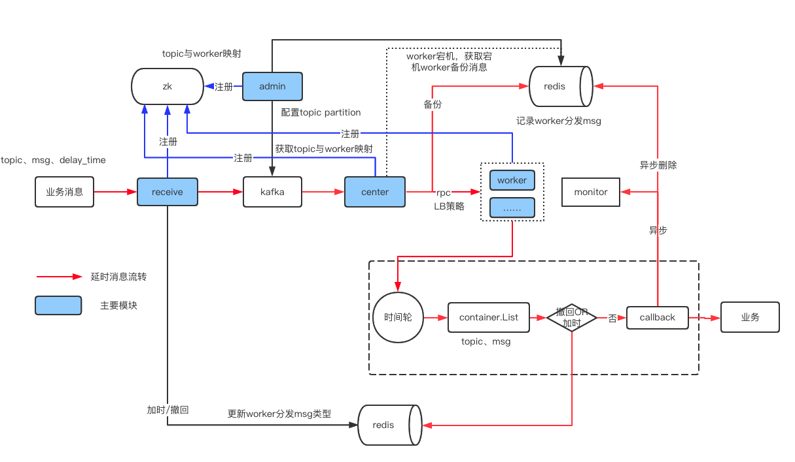
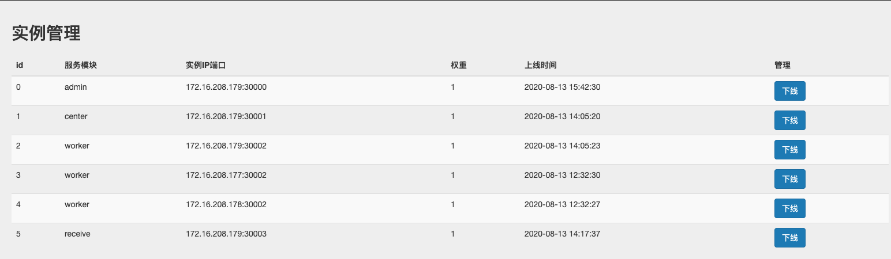
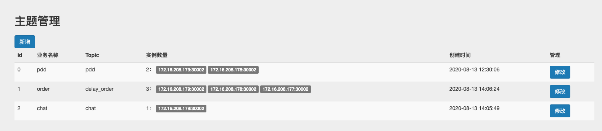
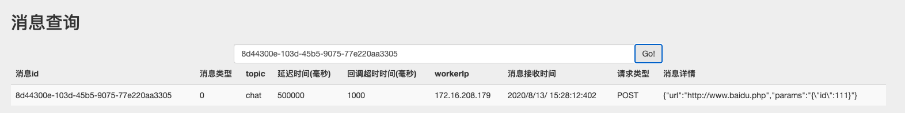
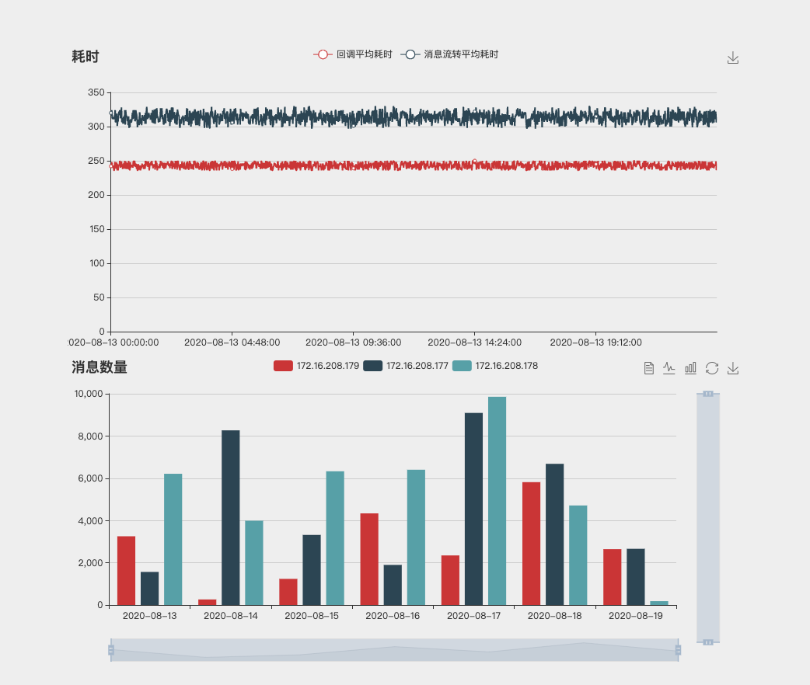

# sorakaQ
sorakaQ是一个内部实验型项目，具备高扩展性的延迟消息队列中间件，采用Golang开发，主要满足延迟任务延迟时间可修改，任务可撤回的需求。

### Featrue
- 支持消息的加时和撤回
- 支持毫秒级延迟时间(延迟时间最小支持100ms，最大支持7天)
- 支持消息持久化
- 支持HTTP协议接入
- 同时支持单机部署和分布式部署
- 提供简易的用户操作和性能监控界面，用户可以监控实例性能，延时消息的数量，并管理延时消息等

### RoadMap
[RoadMap](docs/RoadMap.md)

### 架构设计


详细架构设计见文档[架构设计](docs/architectureDesign.md)


### 环境搭建
- 支持系统

  Linux Red Hat(version >= 4.8.5)
  
  MacOS(version >= 10.14.5)
- redis(version >= 3.0.0)
[下载](http://download.redis.io/releases/)
- kafka(version >= 0.11.0.3)
[下载](http://kafka.apache.org/downloads)
- zookeeper(version >= 3.4.6)
[下载](https://zookeeper.apache.org/releases.html)
- go(version >= 1.13.3)
[下载](https://golang.org/dl/)
### 安装启动
```
源码安装：
配置 GOPATH
cd $GOPATH/src
git clone github.com/momotech/sorakaq

服务启动：
1.All-in-one启动（所有模块部署在一台实例上）
cd $GOPATH/src/sorakaq
sudo sh build.sh
sudo sh start.sh all

2.分布式部署启动（不同模块部署在不同实例上）
cd $GOPATH/src/sorakaq
sudo sh build.sh
//启动admin
sudo sh start.sh admin
//启动receive
sudo sh start.sh receive
//启动center
sudo sh start.sh center
//启动worker
sudo sh start.sh worker
```
### 文档
[接口](docs/api.md)
[默认配置](docs/defaultConfig.md)

### 后台&监控
后台登录地址：http://${SORAKAQ-ADMIN}:9087（端口与admin配置有关）
登录账号密码 admin/admin
- 实例管理



可以查询和下线实例。
- 主题管理



可以查询、管理topic和worker实例映射。
- 消息查询



可以查询消息详情。
- 性能监控



监控当天分钟级别消息流转平均耗时、消息回调平均耗时以及worker当前承载消息数量。

### 性能测试

- 部署环境：使用默认配置，在阿里云主机上(Linux Red Hat 4.8.5-36，4核8G)All-in-one启动，测试topic配置的kafka分区数为10
- 测试结果：消息接收最大QPS为4000左右

|并发数/总请求次数|10/100|50/100|100/100|100/500|100/1000|500/1000|1000/1000|
|----|----|----|----|----|----|----|----|
|消息平均流转时间(ms)|25|30|37|281|534|741|955|

- 测试命令：
ab -k -c xxxx(并发数) -n xxxx(总请求次数) -p /tmp/data.txt http://localhost:9088/sorakaq/msg/submit
(/tmp/data.txt文件内容：{"topic_name":"delay_test", "delay_time":10000,"ttr":1000,"callback":{"request_type":"POST","url":"https://www.baidu.com","params":"{\"id\":111}"}})
### 比较

|延迟队列|方案|时效性|自定义delay-time|消息加时|消息撤回|
|----|----|----|----|----|----|
|基于Redis实现的延迟队列|基于Redis的zset结构+轮训实现|ms|支持|不支持|支持|
|RabbitMQ|基于消息队列TTL和DXL属性实现|ms|不支持|不支持|不支持|
|SorakaQ|基于时间轮实现|ms|支持|支持|支持|


### 注意事项
1. 本项目为公司内部项目，并未大规模使用，目前线上仅进行了小流量验证。
2. 目前worker备份消息模块（redis单实例）存在单点问题，下个版本会接入redis cluster或者mysql cluster进行消息备份。
3. 目前center分发消息使用的是随机策略，可能导致worker负载不均衡，下个版本会提供多种负载均衡策略(轮训、加权轮训、加权随机)，用户可以自主选择，worker权重可以根据worker承载的消息量和负载情况（内存和cpu使用率）进行计算。
4. 目前消息回调失败不会进行重试，下个版本会加入回调失败重试策略。
5. 本项目仅在Linux Red Hat(version为4.8.5)和MacOS(version为10.14.5)系统上进行了验证，其他系统异常未知。
6. 本项目对系统中存在的[异常场景](docs/abnormalScenario.md)、异常场景导致的问题以及解决办法进行了简要说明。

### 如何交流
对于本项目你有任何建议都可以提issue，并且对于有效issue我们会及时跟进。

### 如何贡献代码
沟通邮箱：sorakaQ@immomo.com