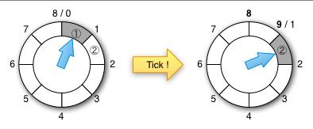

### Timewheel
Golang实现时间轮实现


注：本图来源于网络

### 安装
```golang
go get -u github.com/momotech/timewheel

```

### 使用
```golang
package main

import (
    "github.com/momotech/timewheel"
    "time"
)

func main()  {
    // init timewheel
    tw := NewTimeWheel(100, 50*time.Millisecond)
    // start timewheel
    tw.Start()

    tw.Add(1*time.Second, func() {
        echo(time.Now().Format("2006-01-02 15:04:05"))
    })

    tw.Add(5*time.Second, func() {
        echo(time.Now().Format("2006-01-02 15:04:05"))
    })

    time.Sleep(10 * time.Second)
    
}
```